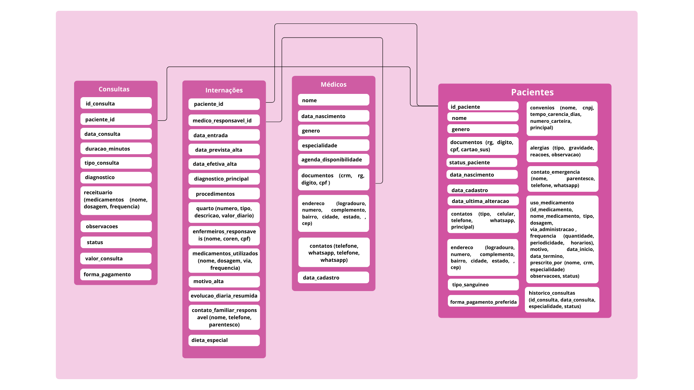

# Hospital Vivare

# 🏥 Sistema de Gestão Hospitalar — MongoDB

Este repositório contém o script de manipulação, atualização e consulta de um banco de dados MongoDB voltado à gestão hospitalar. O sistema cobre funcionalidades essenciais como cadastro de médicos e pacientes, registro de consultas e internações, controle de profissionais de enfermagem e relatórios inteligentes, permitindo o controle total das operações clínicas e administrativas de um hospital.

## 📁 Estrutura

- `scripts/hospital_queries.js`: comandos em MongoDB Shell para atualizar e consultar dados.
- `dados/`: arquivos JSON de exemplo contendo registros reais de médicos, pacientes, consultas e internações.
- `assets/modelo`: png com a imagem do modelo ilustrando o sistema.
- `sobre-as-queries.md`: arquivo read me detalhando e explicando cada querie feita dentro do sistema.

## 📚 Funcionalidades

### 📌 Coleção: medicos
Armazena os dados completos de todos os médicos registrados no hospital, com campos como:

* CRM, CPF, RG

* Especialidades (pediatria, dermatologia, gastroenterologia, etc.)

* Agenda semanal de atendimento

* Endereço e contatos

* Status de atividade (em_atividade) — campo adicionado para sinalizar se o profissional ainda atua na instituição.

🔧 Script incluído atualiza dois médicos como inativos e marca todos os demais como ativos.

### 📌Coleção: pacientes

* Contém as informações dos pacientes do hospital, como:
* Dados pessoais e de contato
* Convênios, alergias, uso de medicamentos
* Histórico de consultas (campo adicionado que armazena um resumo das consultas realizadas por cada paciente)

### 📌 Coleção: consultas

Registra os atendimentos realizados entre médicos e pacientes, incluindo:

* Especialidade da consulta
* Diagnóstico e receituário (medicamentos e orientações)
* Forma de pagamento (dinheiro, cartão, convênio etc.)
* Valor da consulta
* Status (realizada, remarcada, cancelada)

📊 Scripts realizam consultas específicas, como:
* Média de valores de consultas em 2020 sob convênio
* Consultas com receituários múltiplos
* Consultas de menor e maior valor não-convênio
  
### 📌 Coleção: internacoes

* Controla os dados de internações hospitalares:
* Data de entrada, previsão e alta efetiva
* Diagnóstico, procedimentos e medicamentos administrados
* Tipo de quarto: apartamento, enfermaria ou quarto duplo
* Motivo da alta, evolução diária, contato familiar responsável e dieta especial — campos novos adicionados ao modelo
* Profissionais de enfermagem responsáveis (COREN e CPF)

## 📌 Conteúdo do Script
O script principal (em MongoDB Shell) está dividido em blocos que:

* Atualizam campos no banco (updateMany, updateOne)
* Realizam consultas com find, aggregate, lookup, match, project, unwind e operadores como $dateDiff, $expr, $avg, $group.
* Fornecem inteligência sobre os dados: médias, totais, comparações, filtragens avançadas.

## 🧾 Requisitos dos sistema 

* ✅ Inclui pelo menos 12 médicos de diferentes especialidades.
* ✅ Ao menos sete especialidades (ex.: Pediatria, Clínica Geral, Gastroenterologia, Dermatologia).
* ✅ Inclui ao menos 15 pacientes.
* ✅ Cadastre 20 consultas de diferentes pacientes e diferentes médicos.
    * ✅ Alguns pacientes devem realizar mais de uma consulta.
    * ✅ As consultas devem ter ocorrido entre 01/01/2015 e 01/01/2022.
    * ✅ Pelo menos 10 consultas devem ter receituário com dois ou mais medicamentos.
* ✅ Relacionamento internacional com IDs de médicos e pacientes.
* ✅ Cadastre-se ao menos 7 internações.
  * ✅ Pelo menos 2 pacientes deverão ter sido internados mais de uma vez.
  * ✅ Pelo menos 3 quartos devem ser cadastrados.
  * ✅ As internações ocorreram entre 01/01/2015 e 01/01/2022.
  * ✅ Inclui os tipos de quarto: apartamento, quarto duplo e enfermaria, com valores diferentes.
  * ✅ Inclui dados de 10 profissionais de enfermagem.
  * ✅ Associar cada internação a pelo menos 2 enfermeiros.
  * ✅ Os dados de tipo de quarto, convênio e especialidade devem ser povoados no início do sistema.
--- 
**Banco de dados NoSQL otimizado para ambientes hospitalares.**
